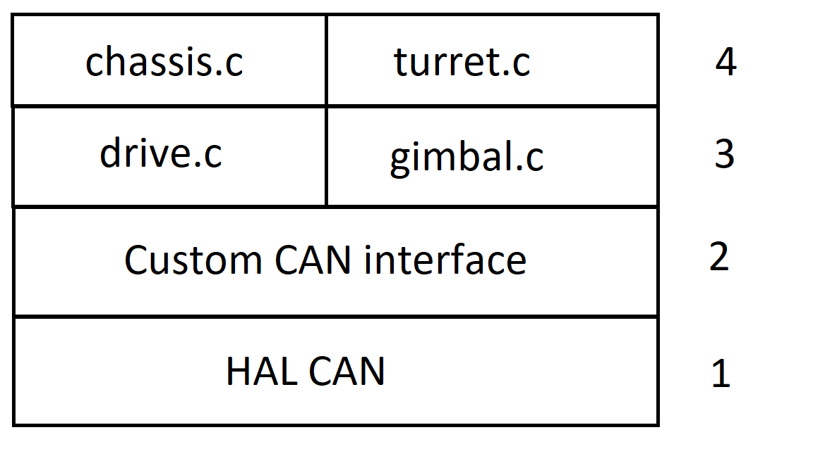

# CAN System Breakdown

The MCB has two CAN busses available for use. Additionally, using DJI's motors
there are 6 uniquely identified motors available for use on each CAN bus.
That gives us up to 12 motors controllable by one MCB.

There are two kinds of motors available:

- RM3510 Drive Motors
- RM6623 Pitch/Yaw Motors

## Motor ID's

RM3510 drive motors can take on ID values between 0x201 and 0x204. They are
controlled by CAN messages from ID 0x200.

RM6623 pitch and yaw motors have ID values 0x205 and 0x206. They are controlled
by CAN messages from ID 0x1FF.

## Initializing the CAN Bus

Each CAN bus requires a Filter, TX Message struct, and RX Message struct.
The Filter is responsible for recognizing new messages and inserting them into
their respective received FIFO buffers. The TX Message and RX Message structs
are memory locations to store the processed messages to be sent/received.

CAN1 and CAN2 will need seperate initialization functions to set them up with
seperate TX and RX message structs.

## Sending CAN Messages

There are two main ways to send CAN messages.

- HAL\_CAN\_Transmit: This takes a CAN handle and a timeout. Since we only
want to transmit one message at a time, we should likely use this function.

- HAL\_CAN\_Transmit\_IT: This takes a CAN handle, and uses interrupts to
queue the message to be sent. We don't currently understand the usage of
this function, and as such are less likely to use it.

We will send messages frequently to each CAN bus. Two messages are required
to control all 6 motors on a single bus. One message is for the four drive
motors, and one message is for the two pitch and yaw motors. As such,
structuring our project to repeatedly transmit with a short timeout two
CAN messages on a Timer interrupt for each CAN bus may be successful.

The motor control values will be calculated and set in the main loop, based
on the most recently received input data from the user or motor speed
controllers. These values (stored in a motors data structure) will be
read and processed to the correct format for the CAN message as part of the
Timer interrupt. As such, the only requirement for controlling the motors
will be to ensure on every iteration of the loop that the motor control
values are correct based on the most recent measured inputs.

## Receiving CAN Messages

CAN messages will be processed by interrupts on FIFO0 receiving a message.
Based on the ID of the recieved message they will call a distinct handler.

## Stack Diagram

1) The lowest level of the CAN System starts with the HAL CAN library from which
   we are building everything in the CAN system on top of. The file provides 
   firmware functions to manage the following 
   * functionalities of the Controller Area Network (CAN) peripheral:
   * Initialization and de-initialization functions 

2) The next level up is the Customized CAN interface. This file implements:
   * Functions for transmitting and receiving CAN messages
   * CAN channel initialization and deinitialization functions
   * CAN filter initializations

3) The third level contains files mostly designed for controlling specific 
   motors and actuators on the robot. This includes:
   * drive.c -> Handles the control and feedback of the DJI Drive
                motors
   * gimbal.c -> Handles control and feedback of the DJI pitch and yaw motors.

4) The upper most level in this stack diagram contains the programs used to 
   control entire subsystems of the robot. This includes:
   * The chassis
   * The turret
   * The lift