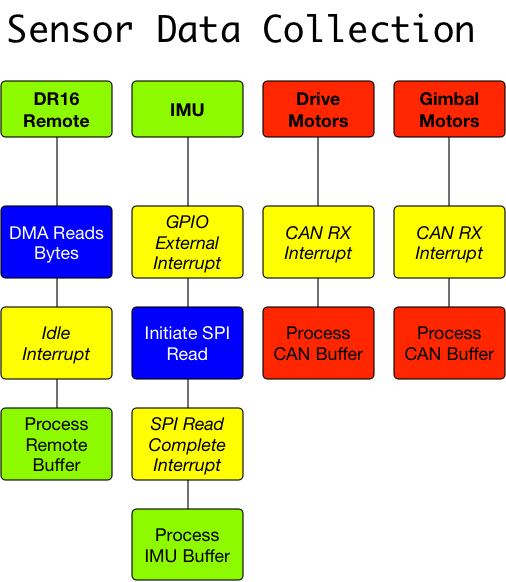
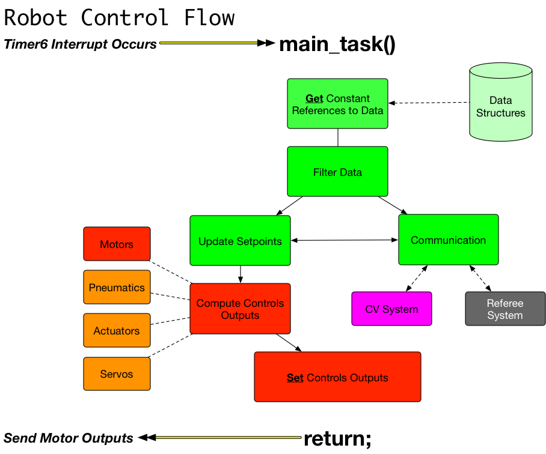

# MCB Initiation Guide

Document goals: With this document, the reader should be able to understand the
process to modify the robot application running on the MCB to design and test
subsystems.

Main Topics Covered:

- Robot Application Overview
- main.c
- Data Collection
- Robot Control Flow
- Development Guide

## Robot Application Overview

In short, our robot takes in _inputs_ and computes _outputs_ continuously.
To best approximate this model, we execute our main control function repeatedly
every 1 millisecond, called `main_task()`. This function processes any new
data, calculates new motor or actuator outputs, and initiates any communication
with external devices. This function is called from an interrupt context in
order to guarantee that it is executed frequently during robot execution, as
well as to delay any other interrupts that modify the data structures used
in the control loop.

Robot initialization occurs in `main()`, to set up and begin all the other
processes, and data collection is managed through interrupts called by the
hardware.

## main.c

The entry point for every C program is through the function `main()`, which
for our project is located in Src/main.c. `main()` is already implemented
to initialize the robot and necessary peripherals for use in the main robot
control flow. Comparing our robot to Arduino code, `main()` takes the roles
of both `setup()` and `loop()` in standard Arduino code, however we do not
run our application from `main()`. Below is a block diagram of what `main()`
does and the peripherals it initializes.

## Data Collection

Data gathered from the onboard IMU, wireless remote and motor speed controller
feedback is all processed using interrupts. While the specific data collection
and interrupt handling for each peripheral is distinct, in general when
sufficient data has been received by the hardware an interrupt occurs to
process the data and store the values into private structures in memory.
A change in data is indicated by incrementing that data structure's
`update_counter` field. To access these data structures, use the corresponding
function that _gets_ a constant pointer to that data structure.

Below is a block diagram of how each peripheral collects data.

## Robot Control Flow

*This is the most important section of this document*. Robot control takes
place in `main_task()`, which is in main\_task.c. This function is called
automatically from the Timer 6 interrupt handler. `main_task()` is what we
need to implement our code in. Below is a brief diagram of what `main_task()`
should do.

Main Task should only be for getting data structures through the _get_ API's,
filtering data, computing outputs and initiating communication to external
devices. _It should not make any blocking calls_ - this will cause delays
and make `main_task()` fail to control the motors safely, and data
collection interrupts will fail to process data promptly.

Subsystem functions should be organized into external subsystem files. Do not
fill `main_task()` with specific implementation of control algorithms. This
will make `main_task()` difficult to work with and debug. It is recommended
that functions called in `main_task()` be named with subsystem underscore
task, e.g. `turret_task()` located in turret.c.

Debug print statements can only be called from the main while loop, in `main()`.
It is recommended to not print continuously, as that does not make for very
helpful debug statements. Songs also must only be played from the main while
loop.

## Development Guide

To write code for the MCB, you will need a Window's PC (running Windows 10
ideally). First, make sure that you have Keil uVision and git installed on
your computer. Clone the repository
([https://gitlab.com/aruw/MCB_Base_Project](https://gitlab.com/aruw/MCB_Base_Project))
and make sure that your master branch is always up to date with the gitlab
master branch (origin/master). To work on features, make a branch with your
name underscore feature name, e.g. tarkan\_buzzer.

If you need additional peripherals, message Tarkan who will help enable them
and set up an API for you to use

Make frequent commits to your branch, so that your work can be tracked and
mistakes can more easily be fixed. Push you code to gitlab on your branch, so
that others can review and contribute to your code. Once your modifiations are
complete, contact Donavan, Tarkan, Teagan or Eric to setup a design review.
Additionaly, create a merge request with a descriptive title and description
of what your modification does. Your description should make reference to
all gitlab issues related to the merge. After going through the design review,
if your code is ready for merging we will merge your code, otherwise we will
provide feedback on what needs to be changed before it can be merged.
