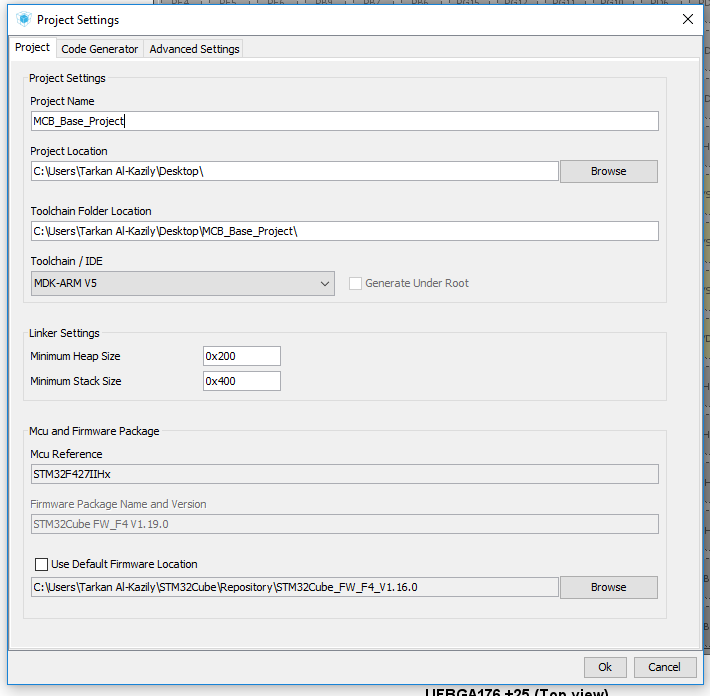
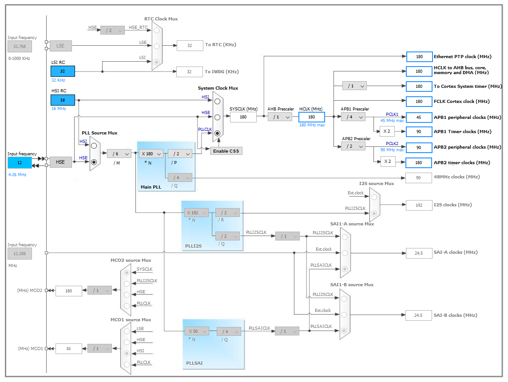

# MCB Project Setup

This document will walk you through the steps of using STM32CubeMX to generate
a fresh development project for the Main Control Board (MCB) provided by DJI.

## STM32CubMX

Download STM32CubeMX from here:
[http://www.st.com/en/development-tools/stm32cubemx.html](http://www.st.com/en/development-tools/stm32cubemx.html)

Once you have downloaded CubeMX for your given platform, open it.
It will check for new updates and download any board files/libraries necessary.

For this project, we will be using an older version of the HAL libraries for
CAN compatibility with DJI's code base. From the Help menu, click on
"Manage embedded software packages". From there, click on __STM32F4__ to view
all the various MCU library packages, and download version 1.16.0 by clicking
the box to the left of the entry. It may take some time to download.

To begin creating a new project, click New Project in CubeMX.
Select the board for the MCB, by typing into the search bar STM32F427II
and selecting STM32F427IIHx. CubeMX will then bringg you to the main
configuration page.

## Project configuration

Under Project, select Settings. It will open a Project Settings window.

In the Project tab, choose a project name and save
location for your project. Under Toolchain/IDE select MDK-ARM V5 for Keil
development. Under MCU and Firmware Package, uncheck "Use Default Firmware
Location" and then click Browse by the file path. Select the folder called
"STM32Cube\_FW\_F4\_V1.16.0". If it is not present, check that you downloaded
the V1.16.0 libraries from the "Manage embedded software packages" menu.

Under Code Generator, select "Copy only the necessary library files" and
"Generate peripheral initialization a a pair of '.c/.h' files per peripheral"
options. Leave all other defaults the same.

Then save your project. You can now generate an empty code base by clicking on
Project > Generate Code. You may click on the prompt following generating the
code to open the project in Keil. If it does not open, check your Project
Settings. You may need to try the steps again with a new project.

## Clock Configuration

It is critical that the system clock be derived from the onboard high speed
crystal. To do this, enable the RCC peripheral by setting the High Speed
Clock (HSE) to Crystal/Ceramic Resonator. The pin settings should be:

- PH0: RCC\_OSC\_IN
- PH1: RCC\_OSC\_OUT

Then, under the Clock Configuration tab, set the Input Frequency (4-26 MHz
field) to 12 MHz. Then set the Hardware Clock speed (HCLK) to
180 MHz (the max). The resulting configuration should match the image:

## Enabling MCB Peripherals

Enable Peripherals from the Pinout tab in CubeMX.
Modify Peripheral settings from the Configuration tab.

### USART1

USART1 is used for the DR16 remote receiver.
Enable USART1 and under Mode select Asynchronous.
The following pin changes need to be made:

- PB6: USART1\_TX
- PB7: USART1\_RX

In the USART1 Configurations settings make the following changes:

- Parameter Settings:
    - Baud Rate: 100000
    - Word Length: 8 Bits
    - Parity: Even
    - Stop Bits: 1
    - Data Direction: Receive Only
    - Over Sampling: 16 Samples
- NVIC Settings:
    - Enable USART1 global interrupt
- DMA Settings: Add a DMA Stream with the following settings
    - DMA Request: USART1\_RX
    - Stream: DMA2 Stream 2
    - Direction: Peripheral To Memory
    - Priority: Low
    - Mode: Circular
    - Increment Address: Peripheral: Unchecked, Memory: Checked
    - Use Fifo: Unchecked
    - Data Width: Peripheral: Byte, Memory: Byte

### USART2

USART2 is used for debug and CV communication.
Enable USART2 and under Mode select Asynchronous.
The following pin changes need to be made:

- PD5: USART2\_TX
- PD6: USART2\_RX

In the USART2 Configuration settings make the following changes:

- Parameter Settings:
    - Baud Rate: 115200
    - Word Length: 8 Bits
    - Parity: None
    - Stop Bits: 1
    - Data Direction: Receive and Transmit
    - Over Sampling: 16 Samples
- NVIC Settings:
    - Enable USART1 global interrupt

There is no need for DMA for USART2.

### CAN1

CAN1 is used for chassis motor control, and turret motor control.
Enable CAN1 as Master Mode.
The following pin changes need to be made:

- PD0: CAN1\_RX
- PD1: CAN1\_TX

In the CAN1 Configuration settings make the following changes:

- Parameter Settings:
    - Prescaler (for Time Quantum): 5
    - Time Quantum (Greyed out): 333.33333333 ns
    - Time Quanta in Bit Segment 1: 3 Time
    - Time Quanta in Bit Segment 2: 5 Time
    - Time for one Bit (Greyed out): 1000 ns
    - ReSynchronization Jump Width: 1 Time

# MCB Project Development

STM32CubeMX will generate the project with the following folder structure:

- Drivers
- Inc
- MDK-ARM
- Src

Libraries and drivers will be put into the Drivers folder. .h files will be
put into the Inc folder. MDK-ARM contains the Keil uVision project files as
well as the build output files. Finally, .c source files will be put into
the Src folder. Additional files at the top level of the folder structure
should be restricted to the CubeMX project file (.ioc). Optionally the project
may have a Documents folder in which documentation, notes and other materials
can be included. In the interest of project control, no other visible top level
files should be included in the project.

## Git integration

See this repository's .gitignore file for a proper .gitignore file.

