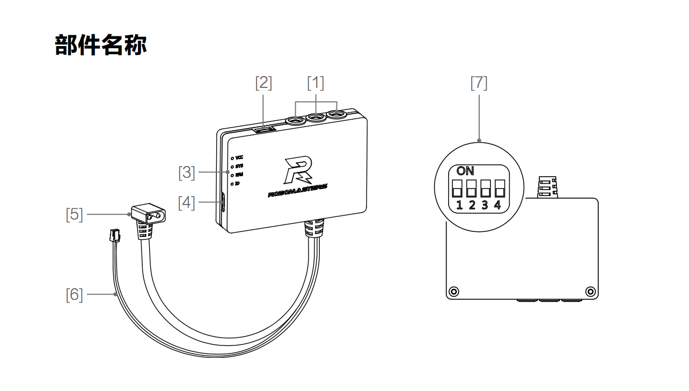
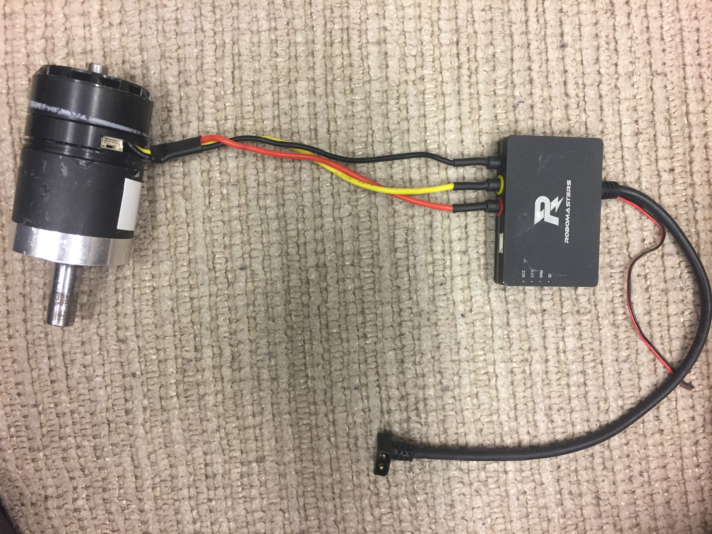

# RM3510 Drive Motors Guide

# 820R ESC Documentation

The 820R Electronic Speed Controller (ESC) is the main device to control the
drive motors. It operates using the CAN protocol, and uses field oriented control
(FOC) to achieve precise torque control. Each motor can be supplied a drive value
between ($-2^15$) to ($2^15 - 1$) specifying the motor speed/direction.

1. Three-phase port. Each colored port connects to the corresponding motor
drive wires, as shown below.

2. Hall Port. Powers and communicates with the Hall effect sensor module
inside the RM3510 motor. Connect with the matching port on the motor.

3. LED indicator. Indicates the various states of the speed controller.
   * VCC: Power indicator. Read indicates that the ESC is powered on.
   * SYS: System indicator. Steady green indicates that the system is operating
   normally, and green flash indicates that the system is running wrong.
   * RPM: Motor speed indicator. Produces green flashes with frequency
   proportional to the motor RPM. An RPM of 0 results in the RPM light
   to be off.
   * ID: Device indicator. This blinks green N times per second, where N is the
   device ID number.

4. Micro USB port, used to update the ESC firmware.

5. Power cord. Connects to the XT30 port on the center adapter board, (TODO
get device name), or directly to the MCB (verify!). Power supply range is
12-36 V.

6. CAN signal line. Connect the center adapter board's CAN port to access the
CAN bus. Red line is CAN High, black line is CAN Low. To comply with CAN
specifications two 120 Ohm termination resistors are required on the CAN bus.
The 820R ESC has these resistors built-in, and users can choose whether to
uses these through the DIP switch.

7. DIP switch. The first, second and third digits of the DIP switch set the
device ID and calibration motor. The fourth digit selects whether to connect
the internal CAN bus 120 Ohm termination resistor.

## Usage

### Connections

Begin with power OFF.

1. Connect the power to the power port on the central adapter board
(or the MCB?).
2. Connect the CAN signal cable to the CAN port of the center adapter board
or MCB.
3. Connect the three-phase connector of the RM3510 gear motor to the
three-phase port of the ESC (yellow to yellow, black to black and red to red).
4. Connect the RM3510 motor's Hall sensor port to the ESC's Hall sensor port.

### Initialization

1. Turn the DIP switches 1, 2 and 3 to the OFF state.
2. Once power is turned on, start the program (?) to calibrate the motor. The
motor will make a BBB... sound. If the calibration fails, the motor will make
a different BB-BB-BB... sound, and you should check the connections.
3. If calibration is succesful, set the dip switch to configure the device ID.
4. Send commands over CAN to control the motor rotation.

Note: Calibration (steps 1 and 2) is only necessary when using the motor for
the first time or when replacing the motor. During the calibration process the
motor will automatically move. In order to prevent the calibration from being
affected by the load, it is recommended that the motor be calibrated under a
no-load condition. If multiple calibration attempts fail, replace the motor.

### DIP switch settings

1. Switches 1, 2 and 3 correspond to bits 0, 1 and 2 of the device ID
respectively. ON corresponds to a bit value of 1.
   * 000: Invalid ID input, used instead to trigger the motor
   calibration procedure.
   * 001: The device ID is 1, and the ESC feedback message identifier is 0x201.
   * 010: The device ID is 2, and the ESC feedback message identifier is 0x202.
   * 011: The device ID is 3, and the ESC feedback message identifier is 0x203.
   * 100: The device ID is 4, and the ESC feedback message identifier is 0x204.
   * 101-111: Reserved device IDs.
2. The 4th bit of the dip switch indicates whether the CAN bus terminating
resistors are connected. ON indicates that they are connected. We shouldn't
need more than 1 terminating resistor set for the entire CAN1 bus, which
should be on the speed controller the furthest distance from the MCB (the
MCB has a terminating resistor already in the circuit).

### CAN protocol - "Letter of Agreement"

CAN Communication Baud Rate: 1 Mbps = 1000000 bits per second

#### ESC expected message format
The message format we must adhere to in order to control the ESC.

ID: 0x200
Frame Type: Standard Frame
Frame Format: DATA
DLC (Data Length Code): 8 bytes
Data Field Structure:

| Data Field       | 0                                | 1                               | 2                                | 3                               | 4                                | 5                               | 6                                | 7                               |
|------------------|----------------------------------|---------------------------------|----------------------------------|---------------------------------|----------------------------------|---------------------------------|----------------------------------|---------------------------------|
| Content          | High 8 bits of the drive current | Low 8 bits of the drive current | High 8 bits of the drive current | Low 8 bits of the drive current | High 8 bits of the drive current | Low 8 bits of the drive current | High 8 bits of the drive current | Low 8 bits of the drive current |
| Drive Board ID   | 0x201                            | 0x201                           | 0x202                            | 0x202                           | 0x203                            | 0x203                           | 0x204                            | 0x204                           |

Drive current range: -32768 to 32768

#### ESC feedback message format
The message format we receive from the ESC.

Identifier  ID: Determined by device ID
Frame Type: Standard Frame
Frame Format: DATA
DLC: 8 bytes

Data Field Structure:

| Data Field       | 0                            | 1                           | 2                          | 3                         | 4    | 5    | 6    | 7    |
|------------------|------------------------------|-----------------------------|----------------------------|---------------------------|------|------|------|------|
| Content          | Encoder value high 8 bits    | Encoder value low 8 bits    | Rotating speed high 8 bits | Rotating speed low 8 bits | NULL | NULL | NULL | NULL |

Transmission frequency: 1KHz
Encoder value range: 0 to 8191
Speed value units: RPM

\newpage

# Using CAN on the STM MCU

Section 32 in the STM32F427 reference manual describes the features of the CAN
peripheral and how it works. Of note is section 32.7, which provides a
functional description of how to use the CAN peripheral.

## Transmitting CAN messages (32.7.1)

> In order to transmit a message, the application must select one empty transmt
mailbox, set up the identifier, the data length code (DLC) and the data before
requesting the transmission by setting the corresponding TXRQ bit in the
CAN\_TIxR register. Once the mailbox has left empty state, the software no
longer has write access to the mailbox registers. Immediately after the TXRQ
bit has been set, the mailbox enters pending state and waits to become the
highest priority mailbox, see Transmit Priority. As soon as the mailbox has the
highest priority it will be scheduled for transmission. The transmission of the
message of the scheduled mailbox will start (enter transmit state) when the CAN
bus becomes idle. Once the mailbox has been successfully transmitted, it will
become empty again. The hardware indicates a successful transmission by setting
the RQCP and TXOK bits in the CAN\_TSR register.

> If the transmission fails, the cause is indicated by the ALST bit in the
CAN\_TSR register in case of an Arbitration Lost, and/or the TERR bit, in case
of transmission error detection.

## Receiving CAN messages

\newpage

# Links

{ width=3in }\

[__Digikey Intro to Brushless DC Motor Control__](https://www.digikey.com/en/articles/techzone/2013/mar/an-introduction-to-brushless-dc-motor-control)

[__NI Controller Area Network (CAN) Overview__](http://www.ni.com/white-paper/2732/en/)
