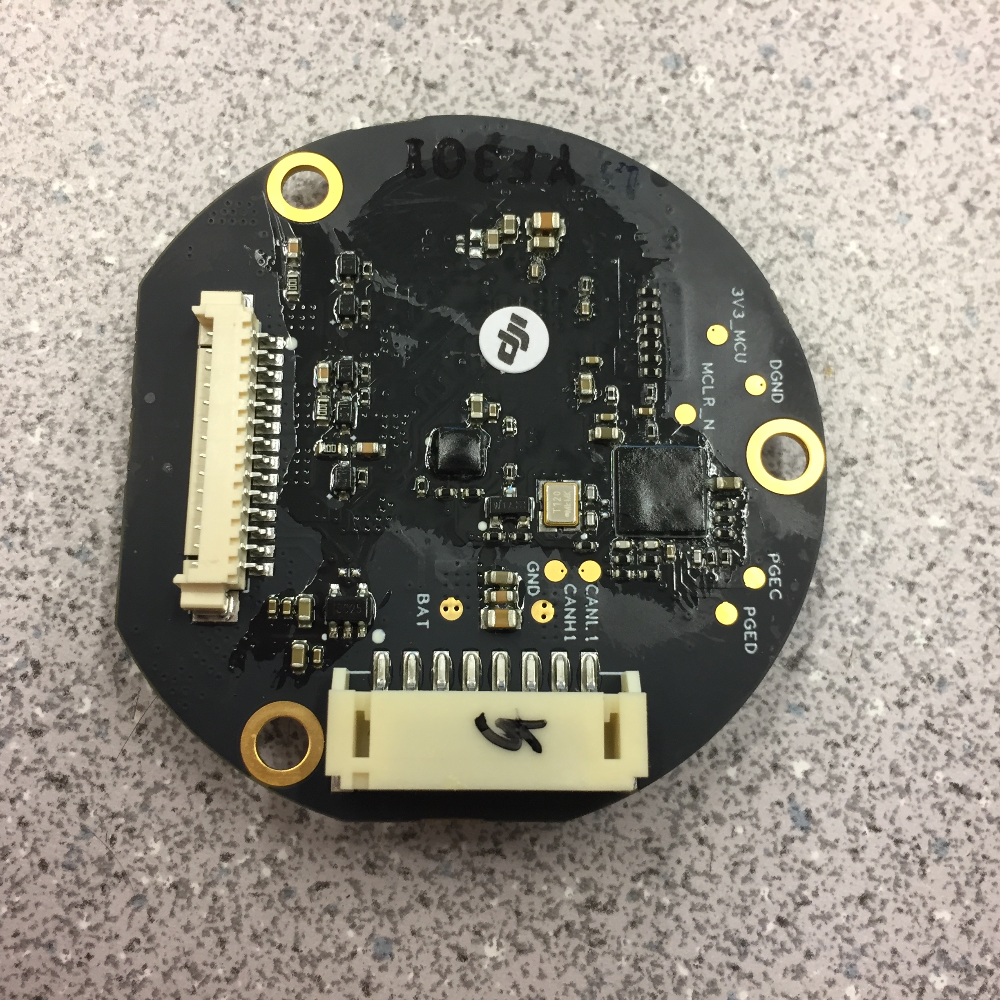

# RM6623 Turret Motors

# 6025 Motor Specifications

* Rated voltage 12 V
* Rated current 0.3 A
* Rated power 3.6 W
* No-load speed 450 r/min
* Stall torque 700 mN · m
* Stall current 3 A
* Angle control accuracy ±0.01°
* Weight 600 g

# RM\_EC60 Brushless Direct Drive Motor Specifications

Electrical parameters:
* Rated voltage 24V
* Rated current 0.3A
* Rated power 7.2W
* No-load speed 450r/min
* Stall torque 1000mN * m
* Stall current 6A
* Angle control accuracy ±0.01º
* Weight 612g

# ESC Documentation

Pitch axis ID: 0x206
Yaw axis ID: 0x205

## Control modes
TODO: Figure out what control modes it has.
The ESC Driver board provides integrated control of the current loop, and
real time output of the operating status information of the motor.

The ESC Driver provides Pan Tilt Zoom control of the turret.

The ESC receives CAN data frames for the Pitch/Yaw motors and sends a torque
command to the driver board in the motor to make it move.

## ESC expected message format

ID: 0x1FF
Frame Type: Standard Frame
Frame Format: DATA
DLC: 8 bytes

The default control command mode has DATA[6] contain 0x00.

| Data Field       | 0                                | 1                               | 2                                | 3                               | 4    | 5    | 6    | 7    |
|------------------|----------------------------------|---------------------------------|----------------------------------|---------------------------------|------|------|------|------|
| Content          | High 8 bits of the drive current | Low 8 bits of the drive current | High 8 bits of the drive current | Low 8 bits of the drive current | NULL | NULL | 0x00 | NULL |
| Drive board ID   | 0x205 (Yaw motor)                | 0x205 (Yaw motor)               | 0x206 (Pitch motor)              | 0x206 (Pitch motor)             | NA   | NA   | NA   | NA   |

Current value range: -5000 to 5000

Send the following command to automatically calibrate the motor:

| Data Field  | 0    | 1    | 2    | 3    | 4    | 5    | 6    | 7    |
|-------------|------|------|------|------|------|------|------|------|
| Content     | 0x00 | 0x00 | 0x00 | 0x00 | 0x00 | 0x00 | 0x04 | 0x00 |

## ESC Feedback message format
TODO: ID's conflict with earlier in the document.
ID: Yaw: 0x206, Pitch: 0x205
Frame Type: Standard Frame
Frame Format: DATA
DLC: 8 bytes

| Data Field | 0                            | 1                           | 2   | 3   | 4   | 5   | 6   | 7   |
|------------|------------------------------|-----------------------------|-----|-----|-----|-----|-----|-----|
| Content    | Mechanical angle high 8 bits | Mechanical angle low 8 bits | Actual Torque current measurement high 8 bits | Actual Torque current measurement low 8 bits | Desired Torque high 8 bits | Desired Torque low 8 bits | NULL | NULL |

Transmission frequency: 1 kHz
Mechanical angle range: 0 to 8191 (0x1FFF)
Actual current measurement range: -13000 to 13000
