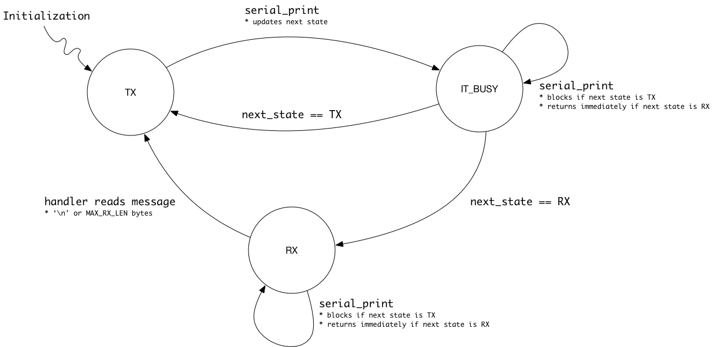

# Serial Communication

We are using USART2 to communicate between computers on the robot. This
many benefits:

- Simple debug information
- Interactive console commands
- Communication between the CV system and the MCB

The most basic implementation for serial communication involves sending and
receiving data in polling mode.

## Polling mode overview

The HAL libraries provide UART communication functions that operate
in polling mode. These are `HAL_UART_Transmit()` and `HAL_UART_Receive()`.
They wait until completion. These functions are not optimal for our final
implementation.

To provide debug output, you can use `HAL_UART_Transmit()` from the
main loop to print to a user console.

## A more advanced approach

For our final robot application, we do not want a communication method
that features polling delays, as that will prevent our system from being
responsive throughout our control loop. Instead, we want to use an interrupt
context to read and write bytes. Again, the HAL libraries provide UART
communication functions to do this: `HAL_UART_Transmit_IT()` and
`HAL_UART_Receive_IT()`. These do not wait until completion, instead use
interrupts to ensure that all the data gets sent properly and signals the
user with a callback respective to the function call.

These have a particular issue when used together - notably, the Receive
call will receive the bytes sent from the Transmit call. This is bad.

To fix this, and to make our overall design simpler, we will alternate
between sending and receiving modes.

## Target Applications

To handle intercommunication properly while using the Transmit and Receive
functions, only one will occur at a time. The MCB will always begin in
the transmit mode, and it's connected computer will be expected to be
ready to receive (not transmitting).

There are two main applications for our communication: Command mode and
data mode. Command mode is when communicating with a user console, who
will enter commands to execute functions on the MCB. Data mode is the
mode in which the MCB communicates with the CV system.

### Command mode example

To communicate with the user console, the MCB and the user will take turns
sending data. The MCB begins in transmit mode, allowing it to send bytes.

1. The MCB sends a prompt to the user to indicate that they can begin
sending bytes; "> ".
2. The MCB goes into receive mode, and will not transmit any data.
3. The user sends bytes accross, representing their command. Because users
are slow, there is no expectation of a timeout.
4. When the user has sent their full command, they will send the newline
character "\n".
5. Upon receiving the newline character, the MCB will leave receive mode
and process the read bytes as a command.
6. The MCB will enter transmit mode to print the output of the command.
7. The process repeats at step 1.

A system needs to be implemented to read bytes in automatically until a
newline character is read.

#### Possible implementations for reading

Use DMA to read into a 2 byte buffer, and interrupt on the half rx callback.
This means we have read a single byte. Put the byte into our actual buffer.
If the byte was a terminating byte __or__ the byte was the end of the buffer,
end the DMA read transaction. Otherwise reset the DMA count back to 2 to
continue receiving bytes.

### Data mode example

To communicate with the CV computer, the MCB and the CV system will take turns
sending data. The MCB begins in transmit mode, allowing it to send bytes.

1. The MCB sends a message to initialize communication with the CV system;
"begin".
2. The MCB goes into receive mode.
3. The CV system will read the MCB's message and reply with its own message to
indicate that it received the message; "hello".
4. The MCB will receive this and will send the turrets current position data.
5. The CV system will receive the MCB data and send back the desired setpoint.
6. Repeat from step 4.

## Serial State Flow

To accomplish these applications, serial will implement three modes.

* `SERIAL_TX` for when serial is ready to transmit
* `SERIAL_IT_BUSY` for when serial is busy transmitting
* `SERIAL_RX` for when serial is receiving data

Upon initialization, the serial module starts in `SERIAL_TX` mode.
To send messages, the `serial_print(char *, serial_mode_t)` function
is called. The `char *` parameter must be a C style string. The
`serial_mode_t` parameter will become the next state upon completing
the transmission.

The conventional method of using `serial_print()` for debug information
is `serial_print(msg, SERIAL_TX)`. This will keep the serial module
in transmit mode and will block if a transmission is currently active,
ensuring that each print statement comes in the correct order.

For applications where reading is necessary, when the application is
ready to read in data, use `serial_print(msg, SERIAL_RX)` to send
a message and switch to receive mode. Alternatively, just use
`serial_set_mode(SERIAL_RX)`. In this mode the serial module
will automatically read bytes and store them into a buffer until the
maximum number of bytes or a '\n' character is reached.
In receive mode, any calls to `serial_print()` result in an error.
It can be manually disabled using `serial_set_mode(SERIAL_TX)`.
