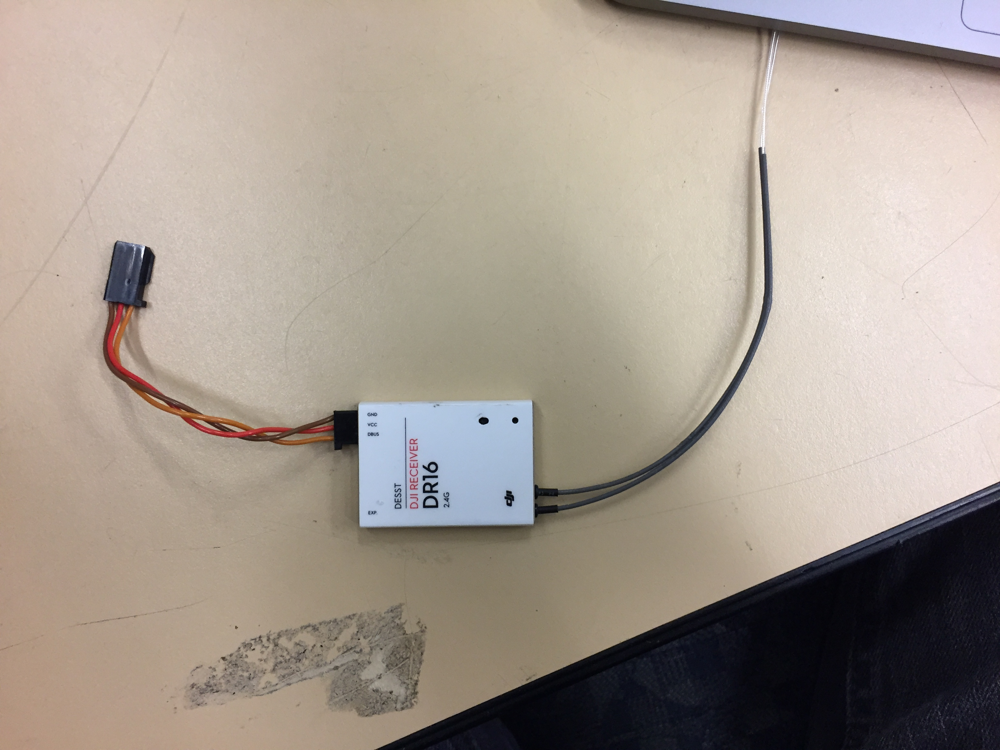
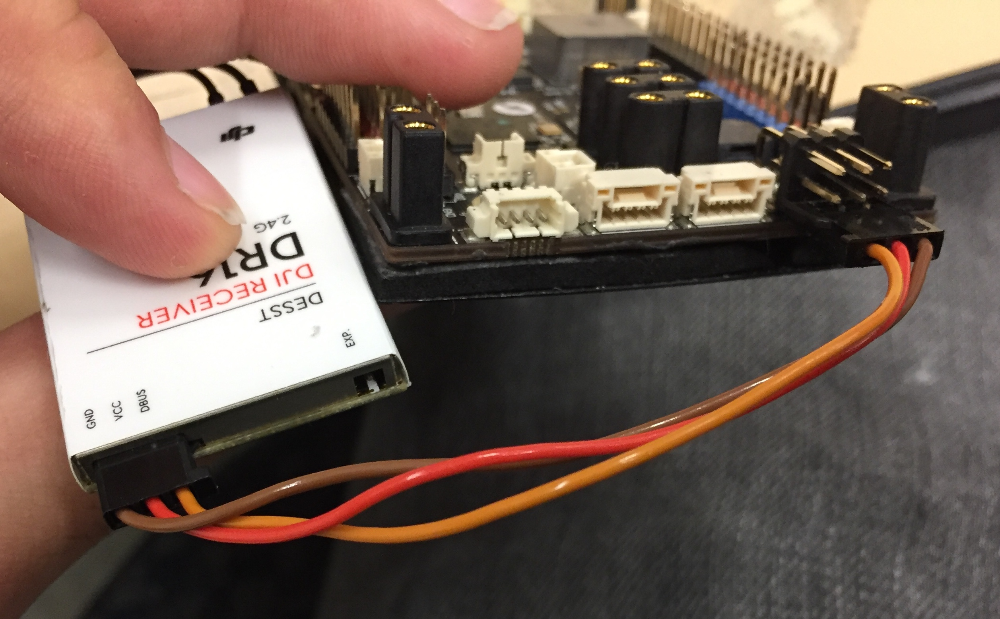
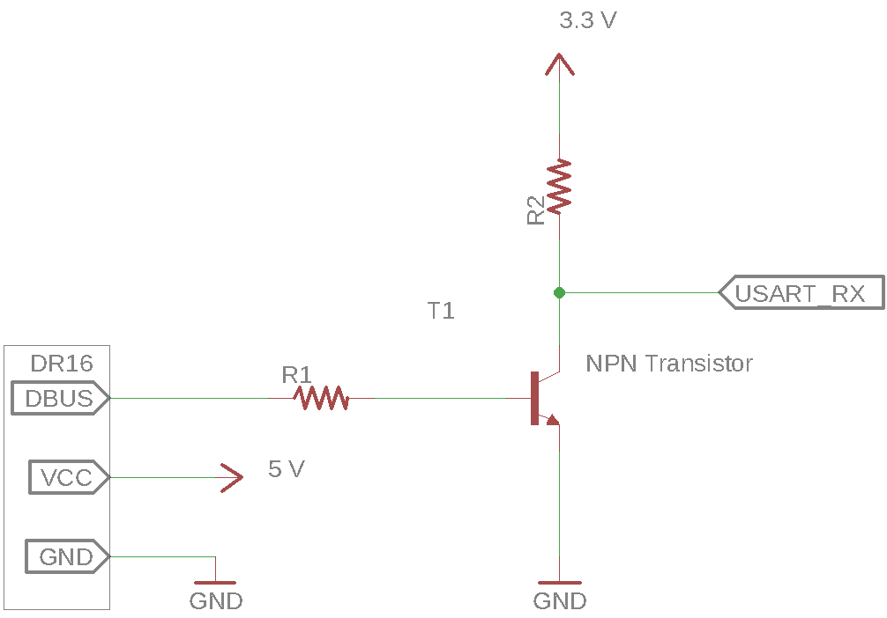
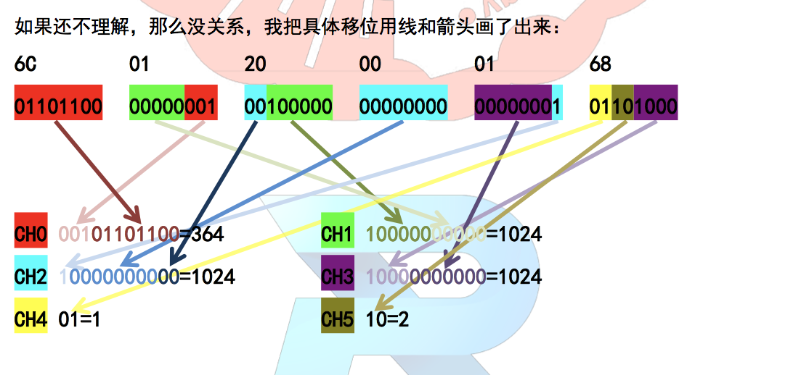

# DJI's DR16 Receiver Guide



This is the main method of controlling the robot wirelessly in competition.
It utilizes a variant of the USART protocol called "DBUS" to output data.

This document will explain how to interface with the DR16 most effectively,
and detail common bugs that can occur through its use.

## Wiring

The DR16 has three wires to connect to it - GND, VCC and DBUS.
The standard way to connect the DR16 to the MCB is through USART1
as shown.



The circuit diagram for connecting the DR16 is



The value of R1 and R2 doesn't entirely matter - ~5 kOhms works effectively.
This circuit is built onto the MCB USART1 port - as such it is not necessary
with the MCB. However, with any other microcontrollers/devices, the
circuit is required. Without the circuit, the data read is garbage.

## USART Initialization

The DR16 uses DBUS protocol, a variant of USART protocol. As such, it is
necessary to use the USART peripheral to receive data from the receiver.
Using the HAL libraries, configure the USART peripheral as follows:
```
void MX_USART1_UART_Init(void)
{

  huart1.Instance = USART1;
  huart1.Init.BaudRate = 100000;
  huart1.Init.WordLength = UART_WORDLENGTH_8B;
  huart1.Init.StopBits = UART_STOPBITS_1;
  huart1.Init.Parity = UART_PARITY_EVEN;
  huart1.Init.Mode = UART_MODE_RX;
  huart1.Init.HwFlowCtl = UART_HWCONTROL_NONE;
  huart1.Init.OverSampling = UART_OVERSAMPLING_16;
  if (HAL_UART_Init(&huart1) != HAL_OK)
  {
    _Error_Handler(__FILE__, __LINE__);
  }

}
```

To most effectively read these
packets, configure the DMA to be in Peripheral to Memory mode for USART1,
and enable interrupts for USART1. Interrupts do not need to be enabled for
DMA.

Here is HAL configuration code to do just that:
```
  if(uartHandle->Instance==USART1)
  {
  /* USER CODE BEGIN USART1_MspInit 0 */

  /* USER CODE END USART1_MspInit 0 */
    /* USART1 clock enable */
    __HAL_RCC_USART1_CLK_ENABLE();
  
    /**USART1 GPIO Configuration
    == NOTE: These pins are for a different board than the MCB ==
    PA9     ------> USART1_TX
    PA10     ------> USART1_RX 
    */
    GPIO_InitStruct.Pin = GPIO_PIN_9|GPIO_PIN_10;
    GPIO_InitStruct.Mode = GPIO_MODE_AF_PP;
    GPIO_InitStruct.Pull = GPIO_PULLUP;
    GPIO_InitStruct.Speed = GPIO_SPEED_FREQ_VERY_HIGH;
    GPIO_InitStruct.Alternate = GPIO_AF7_USART1;
    HAL_GPIO_Init(GPIOA, &GPIO_InitStruct);

    /* USART1 DMA Init */
    /* USART1_RX Init */
    hdma_usart1_rx.Instance = DMA2_Stream2;
    hdma_usart1_rx.Init.Channel = DMA_CHANNEL_4;
    hdma_usart1_rx.Init.Direction = DMA_PERIPH_TO_MEMORY;
    hdma_usart1_rx.Init.PeriphInc = DMA_PINC_DISABLE;
    hdma_usart1_rx.Init.MemInc = DMA_MINC_ENABLE;
    hdma_usart1_rx.Init.PeriphDataAlignment = DMA_PDATAALIGN_BYTE;
    hdma_usart1_rx.Init.MemDataAlignment = DMA_MDATAALIGN_BYTE;
    hdma_usart1_rx.Init.Mode = DMA_CIRCULAR;
    hdma_usart1_rx.Init.Priority = DMA_PRIORITY_LOW;
    hdma_usart1_rx.Init.FIFOMode = DMA_FIFOMODE_DISABLE;
    if (HAL_DMA_Init(&hdma_usart1_rx) != HAL_OK)
    {
      _Error_Handler(__FILE__, __LINE__);
    }

    __HAL_LINKDMA(uartHandle,hdmarx,hdma_usart1_rx);

    /* USART1 interrupt Init */
    HAL_NVIC_SetPriority(USART1_IRQn, 0, 0);
    HAL_NVIC_EnableIRQ(USART1_IRQn);
  /* USER CODE BEGIN USART1_MspInit 1 */

  /* USER CODE END USART1_MspInit 1 */
  }
```

## Reading the Packets
To best read the packets, start the DMA reading bytes into a global buffer up
to some large maximum (50 bytes is appropriate). Enable the IDLE interrupt
flag on the USART. When an IDLE interrupt occurs, read how many
bytes have been read by the DMA. If exactly 18 bytes have been read,
process the packet. At the end of the IDLE interrupt handler,
reset the number of bytes read by the DMA to 0 to begin again.

Sample code, featuring init code (called once in main) and idle handler code:
```
void dr16_dma_init(UART_HandleTypeDef *huart) {
  if (huart->RxState != HAL_UART_STATE_READY) {
    // Something is wrong, so hang
    while (1) {
      blink_LED2(1000);
    }
  }

  // Enable IDLE interrupt
  __HAL_UART_ENABLE_IT(huart, UART_IT_IDLE);

  // Configure huart to point to dr16_rx_buf and have correct size
  huart->pRxBuffPtr = dr16_rx_buf;
  huart->RxXferSize = DR16_MAX_LEN;

  huart->ErrorCode  = HAL_UART_ERROR_NONE;

  // Enable DMA to read in MAX_LEN bytes
  HAL_DMA_Start(huart->hdmarx, (uint32_t)&huart->Instance->DR,
                  (uint32_t) dr16_rx_buf, DR16_MAX_LEN);
  
  SET_BIT(huart->Instance->CR3, USART_CR3_DMAR);
}

void dr16_idle_handler(UART_HandleTypeDef *huart) {
  // Clear Idle flag
  __HAL_UART_CLEAR_IDLEFLAG(huart);
  // Check which huart this is
  if (huart == &huart1) {
    gpio_LED2_toggle();
    // Disable DMA stream temporarily
    __HAL_DMA_DISABLE(huart->hdmarx);
    // Check how many bytes left to be read by the DMA stream
    uint16_t num_data_to_read = __HAL_DMA_GET_COUNTER(huart->hdmarx);
    if ((DR16_MAX_LEN - DR16_PACKET_LEN) == num_data_to_read) {
      // Read exactly DR16_PACKET_LEN bytes
      // This is where you process the buffer using the remote parse code
      dr16_process_buf();
    }
    // Reset DMA stream count
    __HAL_DMA_SET_COUNTER(huart->hdmarx, DR16_MAX_LEN);
    // Enable DMA stream
    __HAL_DMA_ENABLE(huart->hdmarx);
  }
}
```

The dr16 idle handler must be called in `USART1_IRQHandler` defined in
`stm32f4xx_it.c` when there
is an IDLE interrupt. Example code:
```
/**
* @brief This function handles USART1 global interrupt.
*/
void USART1_IRQHandler(void)
{
  /* USER CODE BEGIN USART1_IRQn 0 */
  if (__HAL_UART_GET_FLAG(&huart1, UART_FLAG_IDLE) &&
      __HAL_UART_GET_IT_SOURCE(&huart1, UART_IT_IDLE)) {
    dr16_idle_handler(&huart1);
  }
  /* USER CODE END USART1_IRQn 0 */
  HAL_UART_IRQHandler(&huart1);
  /* USER CODE BEGIN USART1_IRQn 1 */

  /* USER CODE END USART1_IRQn 1 */
}
```

## Processing the buffer
The data is packed in a very peculiar way. I'll let my good pal Li Qingzhi
explain.



The first 6 bytes of the data packet contains the 4 remote control channel
values, which range between 364 and 1684 inclusive, and the two switch values,
which range between 1 and 3 inclusive. The remaining keyboard and mouse data
is stored in the next 12 bytes. To use the RC channel values correctly,
subtract 1024 from the read channel values, centering the value on 0.

Sample code:
```
typedef struct {
    struct { 
        int16_t ch0;  // right horizontal
        int16_t ch1;  // right vertical
        int16_t ch2;  // left horizontal
        int16_t ch3;  // left vertical
        uint8_t s1;   // left switch
        uint8_t s2;   // right switch
    } rc;
    struct {
        int16_t x;
        int16_t y;
        int16_t z;
        uint8_t press_l;
        uint8_t press_r;
    } mouse;
    struct {
        uint16_t v;
    } key;
} RC_Ctl_t;

int remote_parse_buf(uint8_t  *buf, RC_Ctl_t *RC) {
  RC->rc.ch0 = (buf[0] | buf[1] << 8) & 0x07FF;
  RC->rc.ch0 -= 1024;
  RC->rc.ch1 = (buf[1] >> 3 | buf[2] << 5) & 0x07FF;
  RC->rc.ch1 -= 1024;
  RC->rc.ch2 = (buf[2] >> 6 | buf[3] << 2 | buf[4] << 10) & 0x07FF;
  RC->rc.ch2 -= 1024;
  RC->rc.ch3 = (buf[4] >> 1 | buf[5] << 7) & 0x07FF;
  RC->rc.ch3 -= 1024;

  RC->rc.s1 = ((buf[5] >> 4) & 0x000C) >> 2;
  RC->rc.s2 = (buf[5] >> 4) & 0x0003;

  if ((abs(RC->rc.ch0) > 660) || \
      (abs(RC->rc.ch1) > 660) || \
      (abs(RC->rc.ch2) > 660) || \
      (abs(RC->rc.ch3) > 660))
  {
    // Invalid channel values
    memset(RC, 0, sizeof(RC_Ctl_t));
    return 0;
  }

  RC->mouse.x = buf[6] | (buf[7] << 8); // x axis
  RC->mouse.y = buf[8] | (buf[9] << 8);
  RC->mouse.z = buf[10] | (buf[11] << 8);

  RC->mouse.press_l = buf[12];
  RC->mouse.press_r = buf[13];

  RC->key.v = buf[14] | buf[15] << 8; // keyboard code
  return 1;
}
```

## Printing Remote Control Data

You'll need to enable a USART port other than USART1 in order to print out
remote control data. Once you have a remote control, you can format it into
a human readable string using the below formatting code. Don't print in the
interrupt context, do so in the main loop.
```
#include "string.h"

void remote_to_string(char *buf, uint32_t len, RC_Ctl_t *RC) {
  const char *format = "rc:\n ch0:%d\n ch1:%d\n ch2:%d\n ch3:%d\n s1:%u\n s2:%u\n";
  snprintf(buf, len, format, RC->rc.ch0, RC->rc.ch1, RC->rc.ch2, RC->rc.ch3, RC->rc.s1, RC->rc.s2);
}
```
